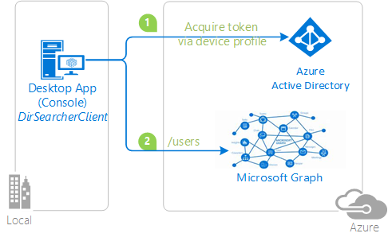

# Invoking an API protected by Azure AD from a text-only device

## About this sample

This sample is based on the .NET Core sample [active-directory-dotnet-deviceprofile](https://github.com/Azure-Samples/active-directory-dotnet-deviceprofile).

### Overview

This sample demonstrates how to leverage ADAL4J from apps that **do not have the capability of offering an interactive authentication experience**. It enables this app to:

- authenticate a user
- and call to a web API (in this case, the [Microsoft Graph](https://graph.microsoft.com))

The sample uses the OAuth2 **device profile flow** similar to the one described [here](https://developers.google.com/identity/protocols/OAuth2ForDevices?hl=en). The app is built entirely on Java, hence it can be ran as-is on Windows (including Nano Server), OSX, and Linux machines.

To emulate a device not capable of showing UX, the sample is packaged as a console application.
The application signs users in with Azure Active Directory (Azure AD), using the Active Directory Authentication Library for Java (ADAL4J) to obtain a JWT access token through the OAuth 2.0 protocol.  The access token is sent to Azure AD's Microsoft Graph API to obtain information about other users in their organization.



If you would like to get started immediately, skip this section and jump to *How To Run The Sample*.

### Scenario

This sample solution is a command-line utility that can be used for looking up basic information for users in Azure AD tenants. The project targets Java: it has been tested on Windows and Ubuntu Linux.

The application obtains tokens through a two steps process especially designed for devices and operating systems that cannot display any UX. Examples of such applications are applications running on iOT, or Command-Line tools (CLI). The idea is that:

1. whenever a user authentication is required, the command-line app provides a code and asks the user to use another device (such as an internet-connected smartphone) to navigate to [http://aka.ms/devicelogin](http://aka.ms/devicelogin), where the user will be prompted to enter the code. That done, the web page will lead the user through a normal authentication experience, including consent prompts and multi factor authentication if necessary.


2. Upon successful authentication, the command-line app will receive the required tokens through a back channel and will use it to perform the web API calls it needs.

## About the code

The code for handling the token acquisition process is simple, as it boils down to:

- one call for obtaining the code to display to the user (via `acquireDeviceCode`)
- and one call to poll the service to retrieve the tokens when available (via `acquireTokenByDeviceCode`).

You can find both calls in the sample in the static method `getToken`, from the app root class `App` in App.java.

```Java
private static AuthenticationResult getToken(
            String tenant) throws Exception {
    	
        AuthenticationContext context;
        AuthenticationResult result = null;
        ExecutorService service = null;
       
        service = Executors.newFixedThreadPool(1);
        context = new AuthenticationContext(AUTHORITY + tenant, false, service);
        
        
        if(TOKENCACHE.containsKey(RESOURCE))
        {
        	result = TOKENCACHE.get(RESOURCE);
        	Future<AuthenticationResult> future = context.acquireTokenByRefreshToken(
                    result.getRefreshToken(), CLIENT_ID, null);
            result = future.get();
            TOKENCACHE.put(RESOURCE, result);        	
        }
        else
        {
        	Future<DeviceCode> codeFuture = context.acquireDeviceCode(CLIENT_ID, RESOURCE, null); 
        	DeviceCode codeResult = codeFuture.get();
        	System.out.println("You need to sign in.");
        	System.out.println(codeResult.getMessage());
        	
        	Boolean shouldRetry = false;
        	do {        		        
	        	try
	        	{
		        	Future<AuthenticationResult> future = context.acquireTokenByDeviceCode(codeResult, null);
		        	result = future.get();
		        	TOKENCACHE.put(RESOURCE, result);
		        	shouldRetry = false;
	        	}
	        	catch(ExecutionException oops)
	        	{	  
	        		if(oops.getCause() instanceof AuthenticationException)
	        		{
	        			AuthenticationException oops2 = (AuthenticationException)oops.getCause();
		        		System.out.println("Caught AuthenticationException: " + oops.getMessage());
		        		if(oops2.getErrorCode() == AdalErrorCode.AUTHORIZATION_PENDING)
		        		{
		        			shouldRetry = true;
		        			Long waitTime = codeResult.getInterval();
		        			System.out.println("Sleeping " + waitTime.toString());
		        			Thread.sleep(waitTime * 1000);
		        		}
		        		else
		        		{
		        			System.out.println("WTF: " + oops2.getErrorCode() + "\n" + oops2.getMessage());
		        		}
	        		}
	        	}	        		        	
        	}
        	while(shouldRetry == true);
        }

        service.shutdown();


        if (result == null) {
            throw new ServiceUnavailableException(
                    "authentication result was null");
        }
        return result;
    }
```

## How to run this sample

To run this sample, you'll need:

- Eclipse or a similar Java IDE or Maven
- An Internet connection
- A Windows machine (necessary if you want to run the app on Windows)
- A Linux machine (necessary if you want to run the app on Linux)
- An Azure Active Directory (Azure AD) tenant. For more information on how to get an Azure AD tenant, please see [How to get an Azure AD tenant](https://azure.microsoft.com/en-us/documentation/articles/active-directory-howto-tenant/)
- A user account in your Azure AD tenant. This sample will not work with a Microsoft account. If you signed in to the Azure portal with a Microsoft account (previously named live account) and have never created a user account in your directory before, you need to do that now.

### Step 1: Clone or download this repository

```Shell
git clone https://github.com/Azure-Samples/active-directory-dotnet-deviceprofile.git
```

or download and exact the repository .zip file.

> Given that the name of the sample is pretty long, and so are the name of the referenced NuGet pacakges, you might want to clone it in a folder close to the root of your hard drive, to avoid file size limitations on Windows.

### Step 2: Run the sample

Launch the app by entering the following command:

mvn pom.xml

#### Operating the sample

As soon as you start the sample, you will be presented with the following prompt.

```Text
You need to sign in.
To sign in, use a web browser to open the page https://microsoft.com/devicelogin and enter the code B7D3SVXHV to authenticate.
```

Then:

1. Open a browser on any device. For instance, the browser can be on the computer on which you are running the sample, or even your smartphone. Then navigate, as instructed, to [https://aka.ms/devicelogin](https://aka.ms/devicelogin)
2. Once there, type in the code provided by the app (in this sample, I am typing `B7D3SVXHV`) and hit enter. The web page will proceed to prompt you for authentication: please authenticate as a user (native or guest) in the tenant that you specified in the search command. Note that, thanks to the fact that you are using an external browser or a different, browser capable device, you can authenticate without restrictions: for example, if your tenant requires you to authenticate using MFA, you are able to do so. That experience would not have been possible if you had to drive the authentication operations exclusively in the console.
3. Once you successfully authenticate, go back to the console app. You'll see that the app has now access to the token it needs to query the Microsoft Graph API. 
4. The app then executes a second query, obtaining an access token using a cached refresh token. You'll be able to perform the query without extra prompts. 

### Optional: configure the sample as an app in your directory tenant

The instructions so far leveraged the Azure AD entry for the app in a Microsoft test tenant: given that the app is multitenant, anybody can run the sample against that app entry.
To register your project in your own Azure AD tenant, you can:

1. Sign in to the [Azure portal](https://portal.azure.com).
1. On the top bar, click on your account, and then on **Switch Directory**.
1. Once the *Directory + subscription* pane opens, choose the Active Directory tenant where you wish to register your application, from the *Favorites* or *All Directories* list.
1. Click on **All services** in the left-hand nav, and choose **Azure Active Directory**.

> In the next steps, you might need the tenant name (or directory name) or the tenant ID (or directory ID). These are presented in the **Properties**
of the Azure Active Directory window respectively as *Name* and *Directory ID*

#### Register the client app (active-directory-dotnet-deviceprofile)

1. In the  **Azure Active Directory** pane, click on **App registrations** and choose **New application registration**.
1. Enter a friendly name for the application, for example 'active-directory-dotnet-deviceprofile' and select 'Native' as the *Application Type*.
1. For the *Redirect URI*, enter `https://<your_tenant_name>/active-directory-dotnet-deviceprofile`, replacing `<your_tenant_name>` with the name of your Azure AD tenant.
1. Click **Create** to create the application.
1. In the succeeding page, Find the *Application ID* value and record it for later. You'll need it to configure the Visual Studio configuration file for this project.
1. Then click on **Settings**, and choose **Properties**.
1. Configure Permissions for your application. To that extent, in the Settings menu, choose the 'Required permissions' section and then,
   click on **Add**, then **Select an API**, and type `Microsoft Graph` in the textbox. Then, click on  **Select Permissions** and select **User.ReadBasic.All**.

#### Configure the sample to use your Azure AD tenant

In the steps below, ClientID is the same as Application ID or AppId.

Open the solution in Eclipse to configure the projects

#### Configure the client project

1. Open the `App.java` file
1. Find the line where `CLIENT_ID` is set and replace the existing value with the application ID (clientId) of the `active-directory-dotnet-deviceprofile` application copied from the Azure portal.

## Community Help and Support

Use [Stack Overflow](http://stackoverflow.com/questions/tagged/adal) to get support from the community.
Ask your questions on Stack Overflow first and browse existing issues to see if someone has asked your question before.
Make sure that your questions or comments are tagged with [`adal` `java`].

If you find a bug in the sample, please raise the issue on [GitHub Issues](../../issues).

To provide a recommendation, visit the following [User Voice page](https://feedback.azure.com/forums/169401-azure-active-directory).

## More information

For more information, see ADAL.NET's conceptual documentation:

> Provide links to the flows from the conceptual documentation
> for instance:
- [Device profile for devices without web browsers](https://github.com/AzureAD/azure-activedirectory-library-for-dotnet/wiki/Device-profile-for-devices-without-web-browsers)
- [Customizing Token cache serialization](https://github.com/AzureAD/azure-activedirectory-library-for-dotnet/wiki/Token-cache-serialization) (was not done in this sample)